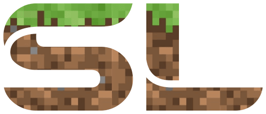

# À propos du projet

Ce plugin a été développé avec l'aide de [Gagafeee](https://github.com/Gagafeee), dans le but d'apporter quelques fonctionnalités additionnelles au serveur Minecraft. Son développement a été conjointement abandonné avec l'arrêt du serveur en raison du manque de temps libre dont je disposais. 
De plus, la maintenabilité du projet étant assez mauvaise, une réécriture totale serait nécessaire afin de pouvoir y ajouter de nouvelles fonctionnalités.

Toutefois, il a été le point de départ au projet [bJloquent](https://github.com/SofianeLasri/bjLoquent).
